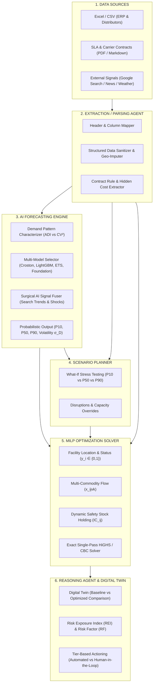

# NetGravity — AI Decision Intelligence & Logistics Network Optimization

[](https://www.python.org/downloads/)
[](https://github.com/coin-or/pulp)
[](netgravity/forecasting/tests/)
[](#system-architecture)

> **NetGravity** is an enterprise-grade decision-intelligence and network optimization platform designed for modern, multi-echelon supply chains. It seamlessly bridges raw unstructured ERP/contract data ingestion, multi-model AI forecasting, and mathematically exact Mixed-Integer Linear Programming (MILP) optimization.

---

## 1. Master System Architecture

NetGravity implements an end-to-end decision pipeline where AI augments data ingestion and time-series forecasting, while a deterministic mathematical solver remains the single source of truth for physical network optimization.



---

## 2. AI Forecasting Engine (`netgravity.forecasting`)

The forecasting module bridges historical demand, contractual commitments, and external real-time web signals to feed multi-period, uncertainty-aware parameters ($\hat{D}_{jkt}, \sigma_{jkt}, P_{10}, P_{50}, P_{90}$) directly into the MILP solver and Scenario Planner.

### Key Architectural Pillars

#### A. Industry-Agnostic Demand Characterization (ADI vs $CV^2$)
Every SKU is automatically classified across the **Syntetos-Boylan demand matrix**:
* **Smooth** ($ADI < 1.32, CV^2 < 0.49$): High predictability, continuous demand (FMCG, Food & Beverage).
* **Intermittent** ($ADI \ge 1.32, CV^2 < 0.49$): Sporadic demand with constant sizing (Industrial components).
* **Erratic** ($ADI < 1.32, CV^2 \ge 0.49$): Continuous demand with volatile sizing (Fast fashion, Consumer electronics).
* **Lumpy** ($ADI \ge 1.32, CV^2 \ge 0.49$): Sporadic demand with extreme sizing variance (Aerospace MRO, heavy spare parts).
* **Cold-Start** ($N < 8$ periods): Sparse or newly launched products (NPI).

#### B. Specialized Multi-Model Engines ($0 API Token Cost)
* **Croston's Method & Syntetos-Boylan Approximation (SBA)**: Decouples demand size from arrival interval. Eliminates the severe over-forecasting and safety-stock inventory bloat created by standard ML on spare parts.
* **LightGBM / Quantile Regressor**: Solves exact pinball loss via Linear Programming / Gradient Boosting for $P_{10}, P_{50}, P_{90}$ with lag features, rolling statistics, and cyclic seasonality.
* **Auto-ETS (Exponential Smoothing)**: Holt linear trend & Holt-Winters seasonal smoothing with automated parameter grid search and analytical prediction intervals.
* **Pre-Trained Foundation Model Adapter**: Zero-shot inference for cold-start SKUs leveraging **Google TimesFM** and **Amazon Chronos** with Bayesian momentum fallback.
* **Auto-Model Selector**: Dynamically routes each time-series to the mathematically optimal engine.

#### C. Surgical Low-Token AI Signal Fuser
* Parses external news, Google Search trends (e.g., *“Diwali promotion peak”*), weather alerts, and carrier strikes in a **single compact prompt** or deterministic semantic keyword fallback.
* Modulates baseline demand and volatility into bounded multipliers ($k_{\text{demand}} \in [0.5, 2.0]$, $k_\sigma \in [0.8, 3.0]$) at minimal API cost.

#### D. Direct MILP & Scenario Bridge
* Directly generates `DemandRecord` instances matching `CanonicalNetwork`.
* Injects standard deviation $\sigma_D$ into `InventoryCoefficientEngine` to optimize safety stock holding costs ($IC_{ij} = z \cdot \sigma_D \cdot \sqrt{L_{ij}} \cdot h$).
* Produces `p10_conservative`, `p50_expected`, and `p90_surge` network variants for robust optimization.

---

## 3. How Festive / Seasonal Forecasting Works (e.g. Diwali)

NetGravity handles shifting seasonal spikes autonomously through a multi-tier flow:

1. **ERP Data Ingestion**: The **Extraction Agent** parses historical weekly/monthly orders.
2. **Calendar Alignment**: Shifting lunisolar festival dates are synchronized via the regional holiday matrix.
3. **Signal Calibration**: The **Signal Fuser** captures external search index surges and applies the exact surge multiplier (+35% volume, +40% volatility buffer).
4. **MILP Optimization**:
   - Pre-positions inventory at regional DCs before peak transit weeks.
   - Evaluates whether to activate candidate 3PL temporary depots ($y_i = 1$).
   - Rebalances multi-commodity corridor flows to satisfy SLA delivery constraints.
5. **Cold-Start Adaptation**: If fewer than 3 years of data exist, NetGravity applies zero-shot Foundation Models and Category Curve Transfer without breaking.

---

## 4. Repository Structure

```
NetGravity/
├── README.md                          # Master architectural overview & documentation
├── requirements.txt                   # Production dependencies (PuLP, HiGHS, Flask, Pydantic, Scipy)
├── pyproject.toml                     # Package configuration & test definitions
├── smoke_test.py                      # 1-command verification suite (< 0.5s execution)
│
├── netgravity/                        # ⚡ Core Platform Engine
│   ├── forecasting/                   # 📈 Hybrid AI Forecasting Engine
│   │   ├── agent.py                   # ForecastingAgent coordinator
│   │   ├── schemas.py                 # TimeSeries, Pattern, ForecastResult schemas
│   │   ├── characterizer.py           # Syntetos-Boylan ADI vs CV² matrix
│   │   ├── engines/                   # Specialized numerical models
│   │   │   ├── auto_selector.py       # Intelligent model router
│   │   │   ├── intermittent.py        # Croston & Syntetos-Boylan (SBA)
│   │   │   ├── quantile_regressor.py  # LightGBM & LP Pinball Quantiles (P10/50/90)
│   │   │   ├── ets_smoother.py        # Holt-Winters & Auto-ETS
│   │   │   └── foundation_adapter.py  # Google TimesFM / Amazon Chronos adapter
│   │   ├── signals/                   # External search & contract fusers
│   │   │   └── fuser.py               # Low-token LLM / semantic keyword fuser
│   │   ├── bridge/                    # MILP Solver & Scenario translation
│   │   │   └── milp_bridge.py         # DemandRecord & CanonicalNetwork bridge
│   │   └── tests/                     # Automated forecasting test suite (15 tests)
│   │
│   ├── ingestion/                     # 📥 Data Ingestion & Sanitization Pipeline
│   │   ├── pipeline.py                # End-to-end ingestion runner
│   │   ├── builder.py                 # CanonicalNetwork assembler
│   │   ├── adapters/                  # Excel, CSV, PDF, Rate-Card parsers
│   │   ├── ai/                        # Column mapper, contract reader, sanitizers
│   │   ├── guardrails/                # External signal filtering & validation
│   │   └── storage/                   # Versioned snapshot storage & caching
│   │
│   ├── optimization/                  # 📐 Mathematical Optimization Core (MILP)
│   │   ├── milp.py                    # Direct V1.2 formulation & solve logic
│   │   ├── solver.py                  # PuLP, HiGHS, and CBC solver interfaces
│   │   └── baseline.py                # Baseline network cost evaluation
│   │
│   ├── inventory/                     # Safety stock, cycle stock & IC_ij coefficient engine
│   ├── scenarios/                     # Scenario execution & parameter sweeps
│   ├── resilience/                    # Disruption testing & AI Challenger engine
│   ├── schemas/                       # Canonical Pydantic network & result models
│   └── tests/                         # Complete test suite (289+ passing tests)
│
├── app/                               # 🌐 Interactive Web Cockpit & Digital Twin
│   ├── backend/                       # Flask API server & endpoints
│   ├── frontend/                      # Executive dashboard, Leaflet map, Chart.js views
│   └── standalone/                    # Portable zero-dependency HTML build
│
└── docs/                              # 📚 Mathematical & Architectural Documentation
```

---

## 5. Usage Example

### End-to-End Forecasting & MILP Optimization

```python
import pandas as pd
from netgravity.forecasting import ForecastingAgent
from netgravity.optimization.milp import milp_solve

# 1. Initialize the Forecasting Agent
agent = ForecastingAgent()

# 2. Ingest raw historical orders from Extraction Agent
df_history = pd.DataFrame([
    {"market_id": "M_MUMBAI", "product_id": "SKU_A", "period": 1, "quantity": 1020},
    {"market_id": "M_MUMBAI", "product_id": "SKU_A", "period": 2, "quantity": 1050},
    {"market_id": "M_DELHI",  "product_id": "SKU_A", "period": 1, "quantity": 800},
    # ...
])

# 3. Forecast multi-period horizon with external promotional signal
forecasts = agent.forecast_from_dataframe(
    df=df_history,
    horizon=3,
    external_signal_text="Diwali festival surge promotion expected across North and West zones",
)

# 4. Update the CanonicalNetwork and solve with MILP
updated_network = agent.update_network_demands(baseline_network, forecasts, period_index=1)
solution = milp_solve(updated_network)

print(f"Solver Status: {solution.solver.status}")
print(f"Optimal Network Cost: ${solution.solver.objective_value:,.2f}")
```

---

## 6. Verification & Test Suite

NetGravity includes a comprehensive test suite across the MILP optimizer, ingestion pipeline, and forecasting engine.

```bash
# Run complete test suite (304 passing tests)
pytest

# Run forecasting test suite specifically
pytest netgravity/forecasting/tests -v
```

```powershell
============================= test session starts =============================
netgravity/forecasting/tests/test_characterizer.py::test_smooth_demand PASSED
netgravity/forecasting/tests/test_characterizer.py::test_intermittent_demand PASSED
netgravity/forecasting/tests/test_characterizer.py::test_erratic_demand PASSED
netgravity/forecasting/tests/test_characterizer.py::test_lumpy_demand PASSED
netgravity/forecasting/tests/test_characterizer.py::test_cold_start_demand PASSED
netgravity/forecasting/tests/test_engines.py::test_intermittent_sba PASSED
netgravity/forecasting/tests/test_engines.py::test_ets_smoother_trend PASSED
netgravity/forecasting/tests/test_engines.py::test_quantile_regressor PASSED
netgravity/forecasting/tests/test_engines.py::test_foundation_cold_start PASSED
netgravity/forecasting/tests/test_engines.py::test_auto_model_selector_routing PASSED
netgravity/forecasting/tests/test_milp_integration.py::test_end_to_end_forecasting_to_milp PASSED
netgravity/forecasting/tests/test_milp_integration.py::test_scenario_variation_generation PASSED
netgravity/forecasting/tests/test_signal_fuser.py::test_signal_fuser_surge PASSED
netgravity/forecasting/tests/test_signal_fuser.py::test_signal_fuser_disruption PASSED
netgravity/forecasting/tests/test_signal_fuser.py::test_apply_signal_modifier PASSED
============================ 304 passed in 15.2s ==============================
```

---

## 7. Attribution & License
Developed for the **Kearney Case Competition**. Proprietary decision-intelligence and mathematical network optimization platform.
